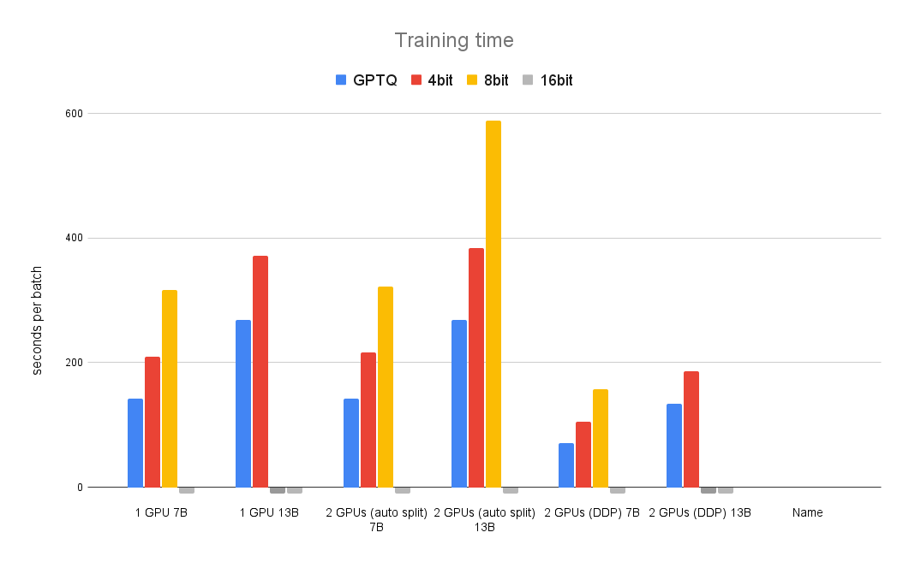
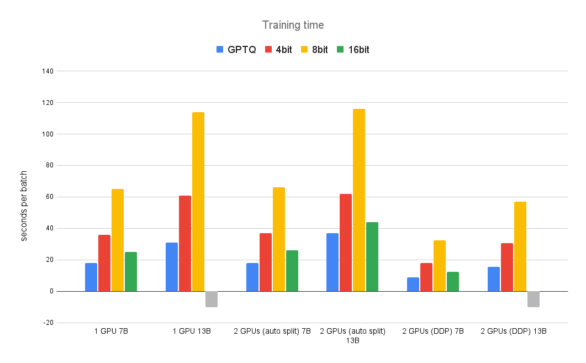
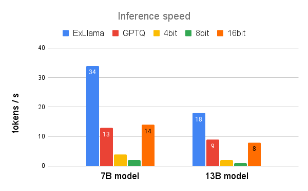

# Benchmark of Quantization Methods (Training & Inference)

## Training

We benchmark the training time of different quantization methods in the following scenarios:
* single GPU run
* 2 GPUs (auto split) using layer offloading
* 2 GPUs (DDP) using Distributed DP training

#### Time taken to complete a batch `bs=128` with `1600 seq_len` (in seconds) on T4 (16GiB) GPU

| GPU Name | Quantization + GPUs     | GPTQ | 4bit | 8bit | 16bit |
|----------|-------------------------| ---- | ---- | ---- | ----- |
| T4       | 1 GPU 7B                | 142  | 210  | 316  | OOM  |
| T4       | 1 GPU 13B               | 268  | 372  | OOM | OOM  |
| T4       | 2 GPUs (auto split) 7B  | 142  | 216  | 322  | OOM  |
| T4       | 2 GPUs (auto split) 13B | 268  | 384  | 589  | OOM  |
| T4       | 2 GPUs (DDP) 7B         | 71   | 105  | 158  | OOM  |
| T4       | 2 GPUs (DDP) 13B        | 134  | 186  | OOM | OOM  |

*gray color indicates OOM happened*

**Dicussion**:

* With limited VRAM (16BiB) on T4 GPU, we can not fit normal model at `fp16` at all due to large model size. Must rely on quantization techniques.
* Current 8-bit quantization training is not as efficient as 4-bit training even though they both come from `bitsandbytes` implementation.
* With auto-split layer offloading on 2 GPU, we can fit bigger model (13B 8-bit) which is not available in single GPU setup.
* Auto-split training almost has the same time as single GPU training (minus small overhead due to inter-GPUs communication). Although it can fit bigger model, GPU utilization is low.
* DDP training scales well and reduce the time for training by half.
* GPTQ has much better latency than `bitsandbytes` 4-bit implemenation while they have similar VRAM usage.
* Training time seems to scale linearly with the model size.
* To best utilize the GPU resources, we should try to fit the model on a single GPU and use DDP strategy to scale the training accross GPU instances.
* There is a big difference between the best configuration on 2 GPUs with 13B model (GPTQ DPP) and worse configuration (8-bit auto-split) (`134s` vs `589s` ~ `4.4x`). Meanwhile, 8-bit auto-split is a popular default configuration if you run HF-based training script on multi-GPUs setup.

#### Time taken to complete a batch `bs=128` with `1600 seq_len` (in seconds) on A100 (40GiB) GPU

| GPU Name | Quantization + GPUs     | GPTQ | 4bit | 8bit | 16bit |
| -------- | ----------------------- | ---- |------| -- | ----- |
| A100     | 1 GPU 7B                | 18   | 36   | 65 | 25    |
| A100     | 1 GPU 13B               | 31   | 61   | 114 | OOM |
| A100     | 2 GPUs (auto split) 7B  | 18   | 37   | 66 | 26    |
| A100     | 2 GPUs (auto split) 13B | 37   | 62   | 116 | 44    |
| A100     | 2 GPUs (DDP) 7B         | 9    | 18   | 32 | 13    |
| A100     | 2 GPUs (DDP) 13B        | 16   | 31   | 57 | OOM |

*gray color indicates OOM happened*

**Dicussion**:

* Moving to a bigger GPU, we can fit 7B model at `fp16`, however 13B model still do not fit.
* `fp16` kernel is much more efficient than current 8-bit and 4-bit quantization from `bitsandbytes`. We need to trade off processing time for memory saving benefit.
* Similar trends can be observed: moving to bigger model scales the training time linearly to the model size. Auto-split strategy has mostly same training time compare to single GPU setup. However, they enable to fit bigger model size with the same quantization method.
* GPTQ CUDA kernel is effcient and has similar latency with `fp16` mode while drastically reduce memory requirement.
* There is a bigger gap between best vs worse configuration: GPTQ DDP vs 8-bit auto-split (`16` vs `116` ~ `7.2x`).

### Summary

* There is a trade-off between memory saving and processing time with quantization techniques from `bitsandbtyes`. Processing time can sometimes double when using quantization techniques in compare to normal `fp16`.
* To maximize GPU usages and scale-up training effectively, we should use DDP and try to fit the model on a single GPU.
* GPTQ enables a good balance between memory saving and training time. Although the setup is a bit more complex (requires model conversion and custom `autograd` implementation), it is still promising to fit bigger model with reasonable training time.

## Inference

#### Inference speed (seconds/item)

- Inference tokens throughput on T4 GPU

- Processing time on T4 GPU (seconds per item)

|  GPU Name | Name      | ExLlama | GPTQ | 4bit | 8bit | 16bit |
|-----------| --------- | ------- | ---- | ---- | ---- | ----- |
| T4        | 7B model  | 9       | 26   | 80   | 120  | 25    |
| T4        | 13B model | 18      | 52   | 175  | 211  | 48    |

### Summary

- Processing time can greatly vary between different backends. `bitsandbytes` has significantly worse latency (3x - 4x slower than normal `fp16`) .
- GPTQ kernel has similar latency as `fp16` mode, which is a huge plus since it reduces memory requirements by 4 times. You can fit bigger model with the same hardware while keeping the efficiency of matrix computation.
- ExLlama is currently the most efficient inference backend for GPTQ quantized model with double the speed compare to normal GPTQ kernel.
